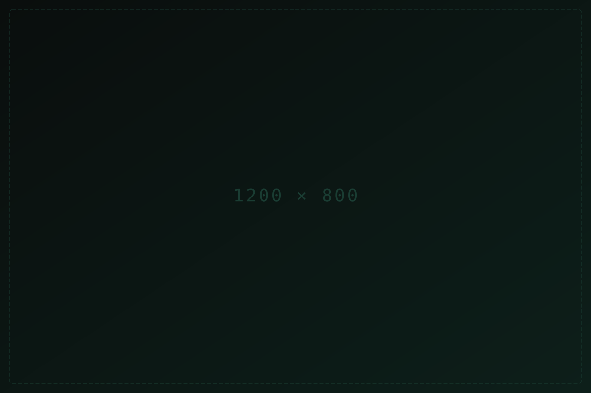

# phosphor-site

> Magazine-grade Jekyll personal site template with a **tactical telemetry** aesthetic — phosphor-green-on-void-dark HUD UI, CRT grain, scan lines, and an editorial layout.

[](LICENSE)
[](https://jekyllrb.com)

<!-- TODO: drop a screenshot or GIF of the home page here -->


---

## Features

- **Tactical telemetry aesthetic** — phosphor-green-on-void-dark HUD with CRT grain, scan lines, and an editorial magazine grid.
- **Custom cursor** — inverted triangle + blend-difference ring + aurora, with velocity-based tilt/scale/trail and scrollbar-drag tracking. Auto-disables on touch and `prefers-reduced-motion`.
- **PJAX soft router** — `fetch()` + DOMParser swaps only `<main>`; the shell (cursor, navbar, footer, atmosphere) lives for the tab lifetime. View Transitions API cross-fades.
- **Token-driven design system** — two layers (`_sass/_variables.scss` compile-time + `_sass/_tokens.scss` runtime CSS custom properties), auto light/dark theme via `[data-theme]`.
- **Front-matter-driven pages** — content lives in YAML front matter, not HTML. Layouts compose sections via `` guards: omit a key and the section doesn't render.
- **Portfolio + blog collections** — `_projects/` and `_articles/` with tag/category filtering, search, and visibility toggles (`hidden_*` / `dimmed_*`).
- **SEO & feeds built in** — `sitemap.xml`, Atom feed at `/feed.xml` (top-level articles only), Open Graph + Twitter cards, canonical URLs, and `robots.txt`. All driven by `url:` in `_config.yml`.
- **Animation systems** — WAAPI border-trace on cards, scroll-reveal (IntersectionObserver), typewriter, glitch burst, parallax, magnetic buttons, gallery/lightbox, and a random-work stream on the home page.
- **Optional Notion CMS** — sync Notion databases → Markdown at build time. Opt-in; see [`integrations/notion-sync/`](integrations/notion-sync/README.md).

## Quick start

1. **Fork** this repo.
2. **Rename it** to `<your-username>.github.io` (user site) or keep `phosphor-site` (project site — then set `baseurl: "/phosphor-site"` in `_config.yml`).
3. **Edit `_config.yml`** — `title`, `description`, `url`, `repository`, `author`, and `social` block. Set `url` to your deployed origin (e.g. `https://USERNAME.github.io`) — the RSS feed, sitemap, and social-preview cards all depend on it.
4. **Add your photo** at `assets/image/bio-photo.png` (800×800 recommended).
5. **Enable Pages** — repo Settings → Pages → Source: **GitHub Actions**.
6. **Push to `dev`** — the workflow builds and deploys.

Local preview:

```bash
bundle install
bundle exec jekyll serve
# open http://127.0.0.1:4000
```

## Content guide

### Add a project

Copy `_projects/_TEMPLATE.md` to `_projects/<my-project>.md`, fill the front matter, write the body. The portfolio grid picks it up automatically.

```yaml
---
name: My Project
subtitle: One-line summary
image: /assets/image/projects/my-project.png
description: Card summary — appears on the portfolio grid.
category: Web          # freeform; drives the FILTER chips
status: "2024"         # year or status string
tags: [React, TypeScript]
external_links:        # optional
  - { name: "Live", url: "https://…", icon: "external-link-alt" }
  - { name: "Code", url: "https://github.com/…", icon: "github", prefix: "fab" }
---
```

### Add an article

Create `_articles/<my-article>.md`. The `category` must match a `slug` in [`_data/categories.yml`](_data/categories.yml). See [`example-article.md`](_articles/example-article.md) for a minimal sample and [`markdown-reference.md`](_articles/markdown-reference.md) for the full prose-style demo.

```yaml
---
title: My Article
description: One-line summary for cards and SEO.
category: tech         # must match a slug in _data/categories.yml
tags: [Essay, Design]
lang: en
---
```

### Edit the home page

All home-page content lives in [`pages/index.md`](pages/index.md) front matter — `hero`, `random_work`, `stream`, and `cta` blocks. Omit a block to hide its section.

### Edit the about page

[`pages/about.md`](pages/about.md) front matter has 7 schema'd sections (`intro`, `currently`, `skills`, `experience`, `education`, `languages`, `contact`). Each ships with placeholder items showing the shape — replace them.

## Customization

- **Design tokens** — [`_sass/_tokens.scss`](_sass/_tokens.scss) (runtime CSS custom properties: colors, radii, motion) and [`_sass/_variables.scss`](_sass/_variables.scss) (compile-time Sass values). Edit these to re-skin the whole site.
- **Theme** — auto light/dark via `[data-theme]` on `<html>`, toggleable from the navbar. Rules in [`_sass/_theme.scss`](_sass/_theme.scss).
- **Portfolio defaults** — `_config.yml` → `portfolio:` block: `accent_tag` (a tag highlighted in accent color), `hidden_*` / `dimmed_*` (tags/categories collapsed or de-emphasized on the grid).

## Cursor system

The custom cursor is this template's signature interaction. Three files own it:

| File | Role |
|---|---|
| [`_sass/_cursor.scss`](_sass/_cursor.scss) | All cursor CSS — triangle, ring, aurora, hover states, `cursor:none` gate |
| [`assets/js/cursor.js`](assets/js/cursor.js) | Renderer IIFE — rAF loop, smoothing, trail, tilt, scrollbar-drag tracking |
| [`assets/js/main.js`](assets/js/main.js) §CURSOR | Hover resolver — `.is-hover`/`.is-traced` on cards, `setStates({down,drag,zoom,…})` |

It auto-disables on `(hover: none), (pointer: coarse)` and `prefers-reduced-motion: reduce`. See [`plan.md`](plan.md) §5 for the full architecture reference, including why scrollbar-drag tracking is delta-based.

## Notion CMS (optional)

Articles can be authored in Notion and synced at build time. The integration lives in [`integrations/notion-sync/`](integrations/notion-sync/README.md). To enable:

1. Set `ENABLE_NOTION_SYNC=true` in repo Settings → Secrets and variables → Actions → Variables.
2. Add `NOTION_TOKEN` and one `NOTION_DB_<CATEGORY>` secret per category in `_data/categories.yml`.
3. Push — the workflow runs `npm ci && node index.js` before the Jekyll build.

## Tech stack

- **Jekyll 4.3** — static site generator
- **Vanilla JS** — no frontend framework (router, theme, cursor, animations)
- **Bootstrap CSS** — layout utilities only (`container`/`row`/`col-lg-*`/flex); the Bootstrap **JS** bundle was removed
- **Font Awesome** — icons
- **Google Fonts** — typography

## License

[MIT](LICENSE) © 2026 Nuo27
